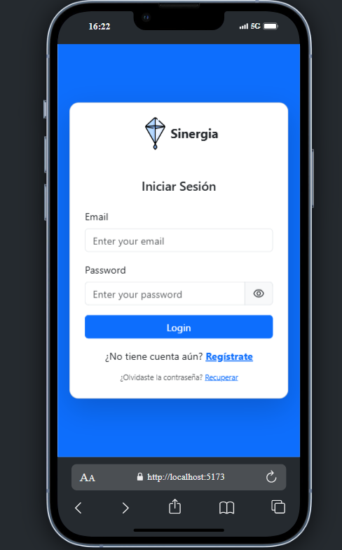
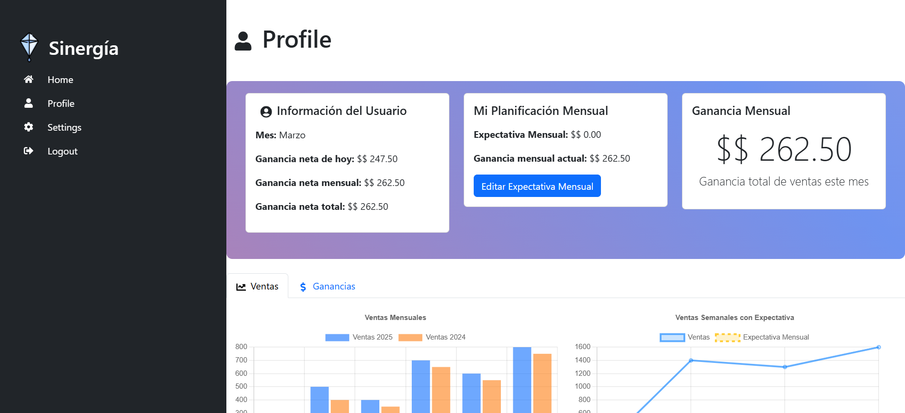

# Sinergia


-
Sinergia es una aplicación web innovadora y moderna para la gestión de ventas por comisión. Está especialmente diseñada para optimizar el manejo de vendedores, productos y comisiones de manera ágil, eficiente e intuitiva. Con una interfaz atractiva y herramientas prácticas, esta aplicación permite a los equipos de ventas maximizar su rendimiento y obtener información detallada en tiempo real.

## ¿Por qué elegir Sinergia?

- 🌟 **Optimización de Ventas:** Facilita el seguimiento de comisiones y el rendimiento de cada vendedor.
- 📊 **Visualización de Datos:** Muestra estadísticas y gráficos interactivos para un análisis completo.
- 🔒 **Autenticación Segura:** Manejo robusto de sesiones para proteger la información.
- 💡 **Fácil de Usar:** Interfaz amigable que reduce la curva de aprendizaje.

## Tecnologías Utilizadas

Este proyecto utiliza las siguientes tecnologías:

- **React:** Biblioteca para la construcción de interfaces de usuario.
- **TypeScript:** Tipado estático para mayor robustez en el desarrollo.
- **Vite:** Herramienta de desarrollo rápida y eficiente.
- **Bootstrap:** Framework de CSS para crear un diseño responsivo y moderno.
- **SweetAlert2:** Librería para mostrar alertas personalizadas.
- **Axios:** Cliente HTTP para realizar peticiones al backend.
- **Chart.js:** Visualización de gráficos y estadísticas de ventas.

## Variables de Entorno

Para configurar el entorno, crea un archivo `.env` en la raíz del proyecto con las siguientes variables:

```
VITE_API_URL=https://sinergiacreativa-backend.onrender.com
VITE_APP_NAME=
VITE_API_DOLAR_CHANGE=
```
VITE_API_URL: URL del backend de la aplicación (asegúrate de que esté configurada correctamente).

VITE_APP_NAME: Nombre de la aplicación.


VITE_API_DOLAR_CHANGE: Clave de API para obtener la tasa de cambio del dólar. Para obtener esta clave, sigue estos pasos:

Dirígete a Exchangerate-API:
```
https://www.exchangerate-api.com/
```
Regístrate para obtener una clave de API gratuita.
Una vez que tengas tu clave, reemplaza  con tu clave personal.
La variable VITE_API_DOLAR_CHANGE es utilizada para obtener el valor de la tasa de cambio actual del dólar estadounidense (USD) a tu moneda local (por ejemplo, ARS).

## Instalación

1. Clona el repositorio:
   ```bash
   git clone https://github.com/JuanLaspiur/SinergiaCreativa-Frontend.git
   ```

2. Ingresa al directorio del proyecto:
   ```bash
   cd Front-gestion
   ```

3. Instala las dependencias:
   ```bash
   npm install
   ```

4. Inicia el servidor de desarrollo:
   ```bash
   npm run dev
   ```

## Scripts Disponibles

- `npm run dev`: Inicia el servidor de desarrollo.
- `npm run build`: Genera una versión de producción.
- `npm run preview`: Previsualiza la versión de producción.
- `npm run lint`: Ejecuta ESLint para analizar el código.

## Características

- Gestión eficiente de vendedores, productos y comisiones.
- Visualización de datos en tiempo real mediante gráficos dinámicos.
- Actualización y edición de perfiles de usuario de manera sencilla.
- Autenticación segura y protección de datos sensibles.
- Diseño moderno y completamente responsivo.

## Contribución

Si deseas contribuir al proyecto, realiza un fork del repositorio y envía un pull request con tus mejoras o correcciones.

¡Gracias por apoyar el desarrollo de Front-Gestión! Juntos podemos mejorar la gestión de ventas por comisión de manera revolucionaria.





